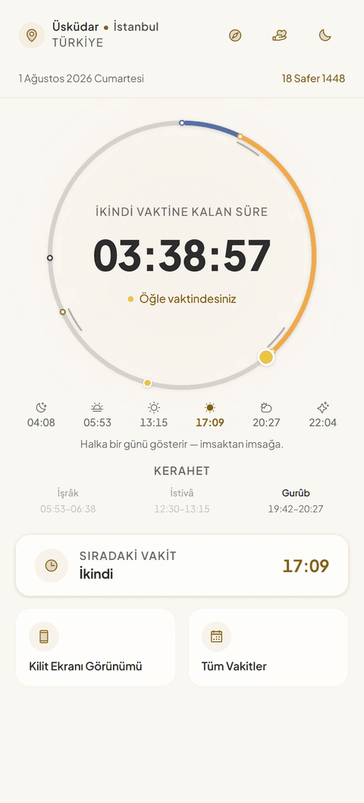
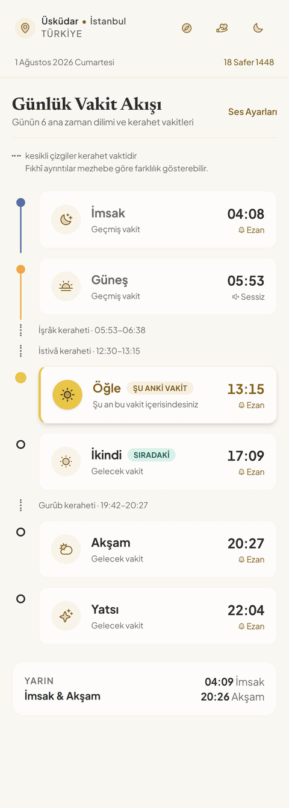
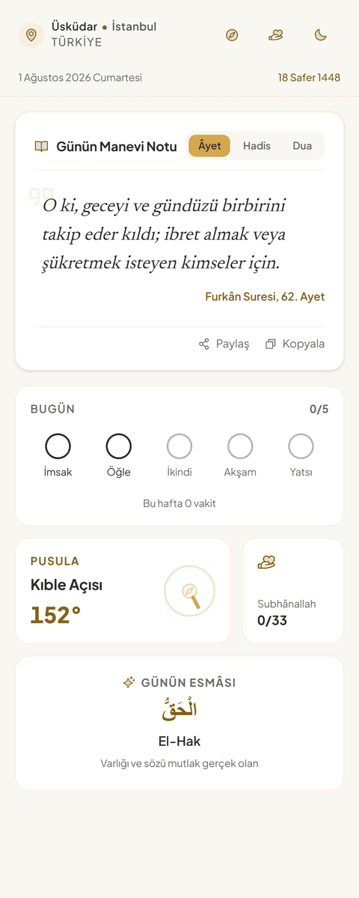
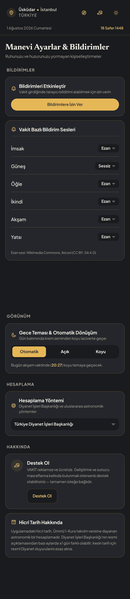

# VAKİT

VAKİT, sakin ve manevi bir arayüzle namaz vakitlerini gösteren, Türkçe bir
Progressive Web App'tir. Konum seçimine göre günlük namaz vakitlerini,
kerahet aralıklarını, hicri tarihi ve günün ayet/hadis/dua içeriğini
gösterir; kıble pusulası ve bir zikirmatik içerir.

## Ekran Görüntüleri

|                              Ana Ekran                              |                                Vakitler                                |
| :-------------------------------------------------------------------: | :---------------------------------------------------------------------: |
|  |  |

|                              Maneviyat                               |                                Ayarlar                                |
| :--------------------------------------------------------------------: | :----------------------------------------------------------------------: |
|  |  |

## Mimari

**Namaz vakitleri tamamen cihazda hesaplanır.** [`adhan`](https://www.npmjs.com/package/adhan)
kütüphanesi, seçili konumun enlem/boylamından vakitleri anlık olarak
hesaplar — hiçbir vakit API'si yoktur ve hiçbir zaman olmayacaktır. Bu
sayede uygulama **sunucu tamamen kapalıyken bile tam çalışır**: konum
seçimi (81 il + yüz(ler)ce ilçe içeren yerel bir liste üzerinden), namaz
vakitleri, kerahet aralıkları, hicri tarih, kıble pusulası ve zikirmatik —
hepsi cihazda, ağ gerektirmeden çalışır. Service worker uygulama kabuğunu
(JS/CSS/font/ikon/ezan sesi) build-time'da gömülü bir sürüm numarasıyla
önbelleğe alır, böylece tamamen çevrimdışı bir açılış bile çalışır.

`server/` altındaki Express sunucusu yalnızca üç şey için gereklidir:

1. **Web Push bildirimleri** — vakit girdiğinde/erken uyarı anında gerçek
   tarayıcı bildirimi (uygulama kapalıyken de).
2. **Genişletilmiş konum araması** — yerel listede olmayan bir yer için,
   yalnızca kullanıcının açık isteğiyle (bkz. aşağıdaki Nominatim notu).
3. **Günün ayeti** — sunucu yoksa veya erişilemezse uygulama sessizce
   sabit bir içerik havuzuna düşer.

Sunucu olmadan statik olarak da (yalnızca `dist/` dağıtılarak) yayınlanabilir;
yukarıdaki üç özellik dışında hiçbir şey bundan etkilenmez.

## Teknoloji Yığını

- **Frontend:** React 19, TypeScript, Vite 6, Tailwind CSS 4, `motion`
  (animasyon), `@phosphor-icons/react` (ikonlar)
- **Vakit hesaplama:** `adhan` (Diyanet, MWL, ISNA, Mısır, Karaçi, Mekke
  yöntemleri desteklenir), `hijri-converter` (hicri tarih)
- **Backend:** Node.js + Express, `web-push`, isteğe bağlı Postgres (`pg`)
- **Test:** Node'un yerleşik `node:test` çalıştırıcısı, `tsx` ile

### Bundle Boyutu

Üretim build'i ~575 KB ham / ~178 KB gzip (JS+CSS). Kritik bir hedef
konulmuyor, ama `rollup-plugin-visualizer` ile bir kerelik ölçümde en büyük
üç katkı: **react + react-dom** (çerçeve), **`motion`** (animasyon
kütüphanesi), **`@phosphor-icons/react`** (ikon seti). Ölçümü tekrarlamak
için: `vite.config.ts`'e geçici olarak `visualizer()` eklenip `npx vite
build` çalıştırılabilir (bkz. git geçmişi — kalıcı bir build adımı değildir).

## Kurulum

```bash
npm install
cp .env.example .env
# .env içine en az VAPID_PUBLIC_KEY / VAPID_PRIVATE_KEY doldurun (aşağıya bakın)
npm run dev:all
```

`npm run dev:all`, Vite dev sunucusunu (**3000** portu, `/api/*` istekleri
Express'e proxy'lenir) ve Express push sunucusunu (**8787** portu,
`SERVER_PORT` ile değiştirilebilir) birlikte başlatır.

Bu proje **npm** ile geliştirilir — tek lockfile `package-lock.json`'dur.

## Ortam Değişkenleri

| Değişken | Zorunlu mu | Açıklama |
| --- | --- | --- |
| `VAPID_PUBLIC_KEY`, `VAPID_PRIVATE_KEY` | Sunucu başlamak için evet | Web Push için — `npx web-push generate-vapid-keys` ile üretilir. |
| `VAPID_SUBJECT` | Hayır | Push servislerinin ulaşabileceği `mailto:` adresi. |
| `SERVER_PORT` | Hayır | Express'in dinleyeceği port (varsayılan 8787). Çoğu PaaS bunun yerine `PORT`'u enjekte eder; sunucu önce `PORT`'a bakar. |
| `DATABASE_URL` | Hayır | Tanımlıysa abonelikler Postgres'te saklanır (kalıcı). Tanımlı değilse yerel bir JSON dosyası kullanılır — **yalnızca geliştirme için uygundur**, çoğu PaaS'ın dosya sistemi geçicidir. |
| `VITE_SUPPORT_IBAN`, `VITE_SUPPORT_NAME` | Hayır | Tanımlıysa "Destek Ol" sayfasında Havale/EFT seçeneği görünür. |
| `VITE_SUPPORT_PAYMENT_URL` | Hayır | Tanımlıysa "Kart ile destek" bağlantısı görünür. |
| `VITE_SUPPORT_STORE_URL` | Hayır | Tanımlıysa "Mağazada Değerlendir" bağlantısı görünür. |
| `VITE_PRIVACY_ENTITY_NAME`, `VITE_PRIVACY_ADDRESS`, `VITE_PRIVACY_CONTACT_EMAIL`, `VITE_PRIVACY_HOSTING_PROVIDER`, `VITE_PRIVACY_LOG_RETENTION_DAYS` | **Yayına çıkmadan önce evet** | Gizlilik Politikası ekranındaki (Ayarlar > Hakkında) veri sorumlusu kimliği. Tanımsız bırakılan her alan, politika metninde gözle görülür bir `[TANIMLANMADI]` uyarısı olarak kalır. |

**`VITE_` önekli değişkenler tarayıcıya gönderilen build'e gömülür** —
buraya yalnızca herkese açık bilgi (IBAN, herkese açık bağlantılar)
konmalıdır, asla gizli bir anahtar değil.

## Dağıtım

Uygulama frontend'i `/api/*`'a **göreli** istek atar, yani sunucu
kullanılacaksa frontend ile API'nin **aynı origin'de** olması gerekir:

```bash
npm install
npm run build     # dist/ oluşturur, precache sürümünü sw.js'e gömer
npm start          # Express, dist/'i statik olarak servis eder + /api/* + SPA fallback
```

Sunucu `0.0.0.0`'a bağlanır ve `PORT` (veya `SERVER_PORT`) değişkenini okur
— Render/Railway/Fly/Heroku gibi platformlarda ek yapılandırma gerekmez.
`index.html` ve `sw.js` `no-cache`, hash'li `/assets/*` dosyaları
`immutable, max-age=31536000` cache header'ı ile servis edilir. `GET
/health` bir sağlık kontrolü ucu olarak kullanılabilir.

Yalnızca statik dağıtım da mümkündür (`dist/`'i herhangi bir statik host'a
koymak) — bu durumda push bildirimleri, genişletilmiş arama ve günün ayeti
devre dışı kalır, geri kalan her şey çalışır.

## Test ve Doğrulama

```bash
npm test              # server + frontend birim testleri
npm run test:tz-utc   # aynısı, TZ=UTC ile (saat dilimi varsayımlarını yakalamak için)
npx tsc --noEmit       # tip kontrolü
npm run visual          # gerçek headless-browser doğrulaması: 4 ekran x 2 tema x
                         # 2 viewport genişliği, taşma/dokunma hedefi/kontrast/
                         # çevrimdışı önbellek/Türkçe ek grep testleri
```

## Nominatim Kullanım Politikası

Genişletilmiş konum araması [OpenStreetMap Nominatim](https://nominatim.openstreetmap.org)
kullanır. Nominatim'in [kullanım politikası](https://operations.osmfoundation.org/policies/nominatim/)
gereği:

- Otomatik tamamlama (her tuş vuruşunda istek) **yasaktır** — bu uygulamada
  arama yalnızca kullanıcının Enter'a basması veya bir arama butonuna
  dokunmasıyla tetiklenir, ve yalnızca yerel ~430 kayıtlık liste sonuç
  vermediğinde.
- İstekler arasında en az 1 saniye olmalıdır — sunucu bunu bir kuyrukla
  (`server/geocoding.ts`, `withCacheAndRateLimit`) zorunlu kılar ve
  tekrarlanan sorguları 24 saat önbellekte tutar.
- Sonuçların altında `© OpenStreetMap katkıcıları` atfı görünür şekilde
  gösterilir.

## Bildirim Sesi — Gerçek Davranış (design-refresh-v3 Faz 7 F1)

**Hiçbir tarayıcı, bir web push bildiriminin sesini özelleştirmeye izin
vermez.** `public/sw.js`'teki `self.registration.showNotification()` çağrısı
yalnızca `silent: true/false` (sessiz açık/kapalı) seçeneğini destekler;
`sound` diye bir alan hiçbir zaman hiçbir tarayıcı motoru tarafından
uygulanmadı (Chromium/Blink, Firefox/Gecko, Safari/WebKit) — bir dönem
spesifikasyona önerilmiş, sonra tamamen kaldırılmıştır. Bu, masaüstü ve
mobilde (Android Chrome, iOS 16.4+ Safari standalone push dahil) aynı
şekilde geçerlidir: bildirim geldiğinde çalan ses, işletim sisteminin/
tarayıcının o an için ayarlı olan **varsayılan bildirim sesidir**, kullanıcı
bunu yalnızca cihazının kendi bildirim ayarlarından değiştirebilir — VAKİT'in
(veya başka bir web uygulamasının) buna hiçbir etkisi yoktur.

Bu yüzden vakit başına seçilebilir bildirim sesi menüsü ("Ezan"/"İlahi 1-3")
kaldırıldı — tutulamayacak bir söz veriyordu. Kalan tek seçenek her vakit
için **Bildirim/Sessiz**'dir. Gerçekten çalışan tek ses özelliği,
uygulama bir sekmede açıkken vakit girdiğinde ezan sesini gerçekten çalan
ayrı ve dürüst bir ayardır: **"Uygulama Açıkken Ezan Sesi Çal"**
(Ayarlar > Bildirimler) — bu tarayıcı sekmesi kapalıyken çalışmaz, çünkü o
an çalışan bir JavaScript yoktur.

## Bilinen Sınırlamalar

- **Kerahet vakitleri** (İşrâk, İstivâ, Gurûb) ve **hicri tarih**, kullanılan
  hesaplama yöntemine/kaynağa göre resmi Diyanet açıklamasından ±1 gün/dakika
  farklılık gösterebilir. Uygulama içinde bu bilgi ilgili ekranlarda ayrıca
  belirtilir.
- Konum araması, sunucu yokken veya `/api/*` erişilemezken sessizce yerel
  listeye ve GPS'e düşer; bu davranış bir hata değildir.

## Lisans

[MIT](LICENSE) — `public/sounds/ezan.mp3` hariç, bkz.
[`public/sounds/ATTRIBUTION.md`](public/sounds/ATTRIBUTION.md) (CC BY-SA 4.0,
Wikimedia Commons).
